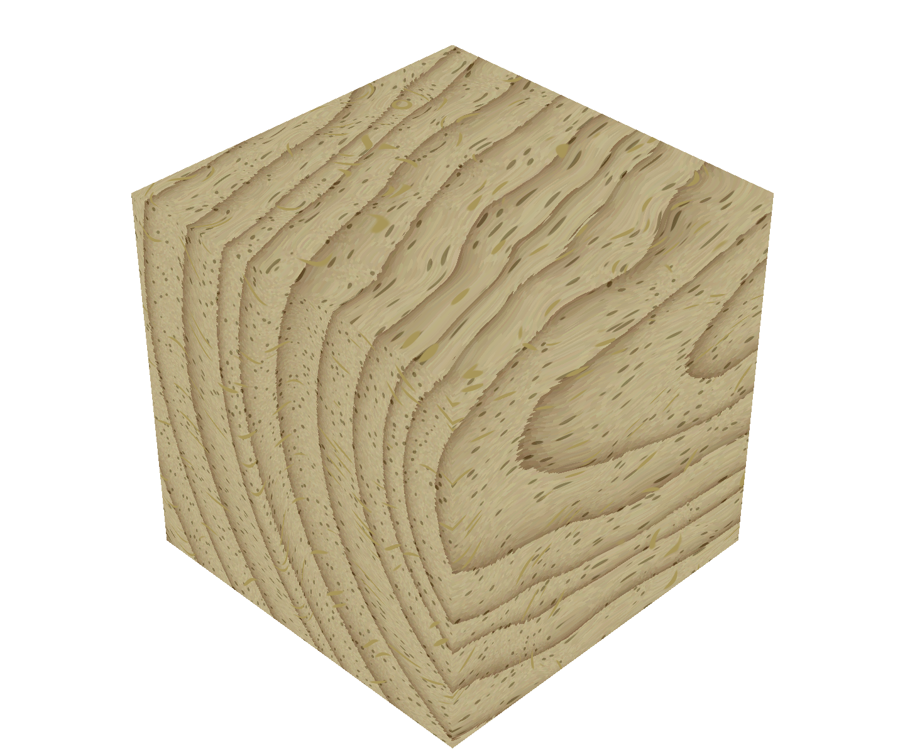

# procedural_wood_texture
glwf/glsl implementation of procedural wood texture

## Fiber construction

  
  
  
  

1: Radial vonoroi cells (scaled up for visibility). 2: Add noise to cell center point positions (within cell boundary). 3: Scale down. 4: Distortion noise added.

## Ring construction

  
  
  

1: Distance field with a modulus operator at a constant value. 2: Noise added to ring distnaces. 3: Distortion noise added.

## Pore construction

  
  
  
  

1: Base pattern of pores. 2: Distortion noise added. 3: Pore position noise added. 4: Occurance rate added

## Ray construation

  
  
  
  

1: Base pattern of rays. 2: Distortion noise added. 3: Pore position noise added. 4: Occurance rate added

## Putting everything together

  
  
  
  

1: Combining fibers and annual rings (let fibers be "pixels" of the annual rings). 2: Blend two colors depending on greyscale value in previous. 3: Add pores. 4: Add rays. 

## Changing pith origin and orientation

  
  

1: Pith origin offsetted. 2: Pith orientation tilted.

##To dos

Normal map (especially pores will look better if rendered with a normal map)
- Create the normal map from height field
- Set up lights

Import information from step 1 of the optimization (pith center line, etc.).

Heartwood/sapwood difference.

Knots.

Consider changing ray construction to enable more raidus-wise overlap.

...
