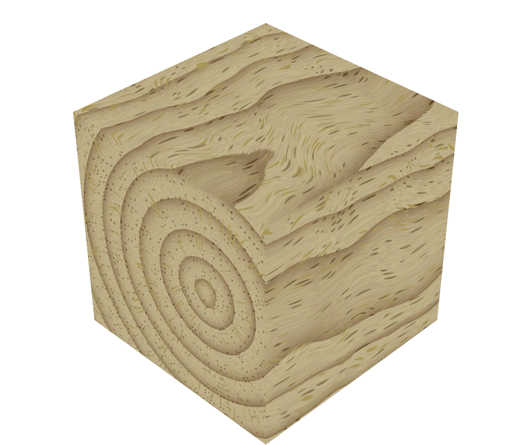

# procedural_wood_texture
glwf/glsl implementation of procedural wood texture

To dos

Normal map (especially pores will look better if rendered with a normal map)

Import information from step 1 of the optimization (pith center line, etc.)

